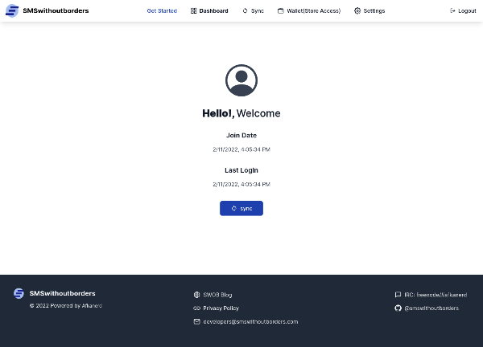

# Features

This document contains all working features and assumes you have a development version of the project setup for testing.

## Sign Up

Register for an SMSWithoutBorders account by filling the form on the [signup](http://localhost:18000/sign-up) page. This is a two step process involving two factor (2fa) authentication of the phone number provided. On successfull submission, you will be redirected to the [verification page](http://localhost:18000/sign-up/verify) to provide the authentication code. Once verified, your account will be created.


The signup page url accepts an optional parameter `ari` to identify users who chose to signup from the mobile app. The value of this parameter is an intent url which the user will be redirected to after two factor authentication is complete

## Login

[Login](http://localhost:18000/login) to access your account using the credentials created at signup.


## Token storage

Authenticated users can access the [wallet page](http://localhost:18000/dashboard/wallet) to save tokens for all supported platforms(Gmail, Twitter and Telegram). Each platform's token can be saved by clicking the save button under its description


When saving tokens for Gmail and Twitter, an authorization screen will be displayed prompting you to grant the requested permissions.

  

Saving Telegram access requires a phone number to be provided. A verification code will be sent which you have to provide to confirm. If you do not already have a Telegram account you will be prompted to create one.

;

## Token Revoke

Authenticated users can delete stored tokens by selecting the revoke button under saved platform's details.

;

## Password Change

Authenticated users can change their current password from [settings](http://localhost:18000/dashboard/settings/change-password)

;

## Password Recovery

Users who have forgotten their account password can recover it by clicking the forgot password link on the [login page](http://localhost:18000/login). The phone number associated with the account is to be provided to which an authentication code will be sent for verification.

;

After the code is successfully verified, the user will be able to set a new password

;

After setting a new password, The user can resume using their account

;

## Account Deletion

Authenticated users can delete their accounts from the [settings page](http://localhost:18000/dashboard/settings) under the [account deletion tab](http://localhost:18000/dashboard/settings/delete-account)

;

## User Dashboard

Authenticated users can access their [dashboard](http://localhost:18000/dashboard/metrics)

;

## Rendering Markdown Files

The [Privacy Policy](http://localhost:18000/privacy-policy) page is loaded from [privacy.md](privacy.md) as markdown into the website. Check [CONFIGURATIONS.md](CONFIGURATIONS.md) on how to link the file.


## Synchronization 

Authenticated users can synchronize their accounts with the mobile app from the [Synchronization](https://localhost:18000/dashboard/sync) page. This process ensures users can communicate securely over sms through the app. 

The sync page uses a background socket connection to enable handshakes. The intial request to obtain the connection url returns a JSON object with two keys 

```JSON
{
 "qr_url": "",
 "mobile_url": "",
}
```